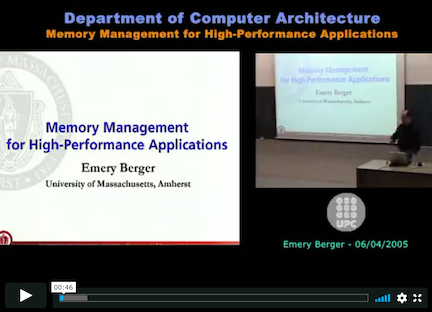

# _The Memory Management Landscape_

The diagram above presents a conceptual map of the memory-management related projects from [the PLASMA @ UMass lab](https://plasma-umass.org/). This work is all joint work with colleagues and grad students (primarily [Charlie Curtsinger](https://curtsinger.cs.grinnell.edu/), [Kathryn McKinley](https://www.cs.utexas.edu/~mckinley/), [Gene Novark](https://www.linkedin.com/in/gene-novark-183a4b20), [Bobby Powers](https://bpowers.net/), and [Ben Zorn](https://www.microsoft.com/en-us/research/people/zorn/)).

-- [Emery](https://emeryberger.com/)

# 

# Performance

## Making `malloc` scale

### [Hoard: A Scalable Memory Allocator for Multithreaded Applications](https://people.cs.umass.edu/~emery/pubs/berger-asplos2000.pdf)

ASPLOS 2000

talk slides: [PowerPoint](https://people.cs.umass.edu/~emery/classes/CMPSCI691P-Fall2002/homework/berger-asplos2000/hoard-presentation.ppt), [SlideShare - low resolution](https://www.slideshare.net/emery/hoard-a-scalable-memory-allocator-for-multithreaded-applications)

Video: _Memory Management for High-Performance Applications_, Emery Berger (covers Hoard, Heap Layers, and Reconsidering Custom Memory Allocation)

[http://hoard.org/](http://hoard.org/)

source: [https://github.com/emeryberger/Hoard](https://github.com/emeryberger/Hoard)

> **ASPLOS Most Influential Paper Award, 2019**: Parallel, multithreaded C and C++ programs such as web servers, database managers, news servers, and scientific applications are becoming increasingly prevalent. For these applications, the memory allocator is often a bottleneck that severely limits program performance and scalability on multiprocessor systems. Previous allocators suffer from problems that include poor performance and scalability, and heap organizations that introduce false sharing. Worse, many allocators exhibit a dramatic increase in memory consumption when confronted with a producer-consumer pattern of object allocation and freeing. This increase in memory consumption can range from a factor of P (the number of processors) to unbounded memory consumption.
>
>This paper introduces **Hoard**, a fast, highly scalable allocator that largely avoids false sharing and is memory efficient. Hoard is the first allocator to simultaneously solve the above problems. Hoard combines one global heap and per-processor heaps with a novel discipline that provably bounds memory consumption and has very low synchronization costs in the common case. Our results on eleven programs demonstrate that Hoard yields low average fragmentation and improves overall program performance over the standard Solaris allocator by up to a factor of 60 on 14 processors, and up to a factor of 18 over the next best allocator we tested.

*   first truly scalable (general-purpose) memory allocator for multiple CPUs
*   provably limits excess memory (_blowup_)
*   acts to prevent false sharing
*   algorithm incorporated into [Mac OS X allocator](https://opensource.apple.com/source/libmalloc/libmalloc-283.100.6/src/magazine_malloc.c.auto.html) and IBM allocator (with lock-free extensions)
*   in continuous development since 1999, continues to be one of fastest general-purpose allocators

## Heap Layers: building high-performance allocators

### [Composing High-Performance Memory Allocators](https://people.cs.umass.edu/~emery/pubs/berger-pldi2001.pdf) (Heap Layers)

PLDI 2001

talk slides: [SlideShare](https://www.slideshare.net/emery/composing-highperformance-memory-allocators-with-heap-layers)

[article by Andrei Alexandrescu, _C/C++ Users Journal_, 2005](https://github.com/emeryberger/Heap-Layers/raw/master/cuj-2005-12.pdf)

source: [https://github.com/emeryberger/Heap-Layers](https://github.com/emeryberger/Heap-Layers)

> Current general-purpose memory allocators do not provide sufficient speed or flexibility for modern high-performance applications. Highly-tuned general purpose allocators have per-operation costs around one hundred cycles, while the cost of an operation in a custom memory allocator can be just a handful of cycles. To achieve high performance, programmers often write custom memory allocators from scratch – a difficult and error-prone process.
>
> In this paper, we present a flexible and efficient infrastructure for building memory allocators that is based on C++ templates and inheritance. This novel approach allows programmers to build custom and general-purpose allocators as “**heap layers**” that can be composed without incurring any additional runtime overhead or additional programming cost. We show that this infrastructure simplifies allocator construction and results in allocators that either match or improve the performance of heavily-tuned allocators written in C, including the Kingsley allocator and the GNU obstack library. We further show this infrastructure can be used to rapidly build a general-purpose allocator that has performance comparable to the Lea allocator, one of the best uniprocessor allocators available. We thus demonstrate a clean, easy-to-use allocator interface that seamlessly combines the power and efficiency of any number of general and custom allocators within a single application._

*   C++ infrastructure - a "grammar" - for building fast memory allocators
*   library of "mixin layers" (each an example of the [curiously recurring template pattern](https://en.wikipedia.org/wiki/Curiously_recurring_template_pattern)), allowing heaps to be composed out of reusable blocks
*   turns out that this approach gives C++ compilers vastly more opportunities to do inlining, yielding better code than monolithic allocators!
*   I re-wrote Hoard to use Heap Layers (resulting in an immediate 15% perf improvement with no algorithmic changes); all subsequent allocator work described below also uses Heap Layers

## Reaps + empirical analysis of custom allocators

### [Reconsidering Custom Memory Allocation](https://people.cs.umass.edu/~emery/pubs/berger-oopsla2002.pdf)

OOPSLA 2002

slides: [SlideShare](https://www.slideshare.net/emery/reconsidering-custom-memory-allocation)

source (in Heap Layers repo): [https://github.com/emeryberger/Heap-Layers](https://github.com/emeryberger/Heap-Layers)

> **OOPSLA Most Influential Paper 2012**: Custom memory management is often used in systems software for the purpose of decreasing the cost of allocation and tightly controlling memory footprint of the software. Until 2002, it was taken for granted that application-specific memory allocators were superior to general purpose libraries. Berger, Zorn and McKinley’s paper demonstrated through a rigorous empirical study that this assumption is not well-founded, and gave insights into the reasons why general purpose allocators can outperform handcrafted ones. The paper also stands out for the quality of its empirical methodology.

*   detailed empirical study intended to answer the question, do custom memory allocators improve performance?
*   compared to general-purpose allocators via API-compatible wrappers written with Heap Layers
*   results:
    -   most custom allocators did not deliver when compared to a state-of-the-art general-purpose allocator (at the time, the Lea allocator, a variant of which is in GNU libc to this day)
    -   exception: regions (a.k.a. arenas, pools). Regions in principle can achieve asymptotic improvements (O(1) or O(log n) frees instead of O(n)), and allocation is fast. However, memory waste also can be high (when a few objects tie down the whole region)
    -   new region-heap hybrid: _reaps_. bump pointer allocation augmented with a freelist. allows for fast reclamation en masse, fast allocation, and still enables reuse. Algorithm rolled into Hoard.

## 

## Compacting memory allocation for C/C++ (!)

### [Mesh: compacting memory management for C/C++ applications](https://people.cs.umass.edu/~mcgregor/papers/19-pldi.pdf)

PLDI 2019

video of talk:
* [Strange Loop 2019, Bobby Powers](https://www.youtube.com/watch?v=c1UBJbfR-H0)

* [CppCon 2019, Emery Berger](https://www.youtube.com/watch?v=XRAP3lBivYM)

source: [https://github.com/plasma-umass/mesh](https://github.com/plasma-umass/mesh)

> Programs written in C/C++ can suffer from serious memory fragmentation, leading to low utilization of memory, degraded performance, and application failure due to memory exhaustion. This paper introduces Mesh, a plug-in replacement for malloc that, for the first time, eliminates fragmentation in unmodified C/C++ applications. Mesh combines novel randomized algorithms with widely-supported virtual memory operations to provably reduce fragmentation, breaking the classical Robson bounds with high probability. Mesh generally matches the runtime performance of state-of-the-art memory allocators while reducing memory consumption; in particular, it reduces the memory of consumption of Firefox by 16% and Redis by 39%.

*   in theory, you can't compact memory in C/C++ programs, because you can't relocate objects (since you can't tell what a pointer is, you can't adjust pointers)
*   BUT: you can compact memory _physically_ (reducing footprint) without altering _virtual _addresses
*   to avoid pathological cases, use a fast O(1) randomizing allocator with _shuffle vectors_ that randomly distribute objects on a full page (contrast with DieHard and friends, which require extra memory to operate efficiently)
*   it's fast, scalable, and saves memory automagically
*   segregates metadata from the heap, which also improves locality - each cache line basically only contains data

# 

# Fault tolerant heaps

## Improving reliability in the face of user memory errors (buffer overflows, use-after-free) via a randomizing allocator

### [DieHard: Probabilistic Memory Safety for Unsafe Languages](https://people.cs.umass.edu/~emery/pubs/fp014-berger.pdfhttps://people.cs.umass.edu/~emery/pubs/fp014-berger.pdf)

PLDI 2006

slides: [SlideShare](https://www.slideshare.net/emery/diehard-probabilistic-memory-safety-for-unsafe-languages), [PowerPoint](http://www.cs.umass.edu/~emery/diehard/diehard-pldi06.ppt)

[Video whiteboard interview of Ben Zorn discussing DieHard and RobustHeap](https://channel9.msdn.com/blogs/peli/ben-zorn-memory-robustness-with-robustheap)

[https://github.com/emeryberger/DieHard](https://github.com/emeryberger/DieHard)

> **PLDI 2016 Most Influential Paper:** The PLDI 2006 “DieHard” paper by Emery Berger and Benjamin Zorn introduced the concept of probabilistic memory safety (for unsafe languages such as C/C++) through three main techniques: (1) randomization of object placement in the heap; (2) overprovisioning of the heap to provide expected gaps between objects; (3) optional replication of processes to enable even greater fault tolerance. This approach was shown to provide protection against a variety of memory errors, including dangling pointers and buffer overflows, as formalized mathematically and evaluated empirically. By fully randomizing heap object locations in memory – effectively pushing address-space layout randomization to the individual object level – DieHard also makes systems more resilient to attack. Variations of DieHard were implemented on Linux, Mac OS, and Windows. The Windows implementation directly influenced the Fault Tolerant Heap of Windows 7 and the Windows 8 user-mode heap allocator.

*   insight: by randomizing the placement and reuse of heap objects within a larger-than-required heap, you can get _probabilistic memory safety_ - make a program with bugs like heap overflows or use-after-free run correctly with high probability
    *   weird fact: as long as objects are near the size of cache lines, this is "ok" for locality; if not, not (especially for systems with non-hierarchical TLBs), where spreading out objects can increase the TLB footprint and seriously degrade performance. this is less of an issue with modern processors.
*   if you are really crazy, you can run multiple versions of code linked with DieHard, and have them vote on the results! this further increases reliability in the face of errors.
*   first practical (O(1) execution time) randomized heap, using the moral equivalent of hash table probing of a bitmap to find free objects
*   as stated above, directly influenced several allocators implemented by Microsoft (where I have spent numerous summers as a visiting researcher)

## Extreme fault tolerance

### [Archipelago: Trading Address Space for Reliability and Security](https://people.cs.umass.edu/~emery/pubs/asplos147-lvin.pdf)

ASPLOS 2008

video : [ASPLOS presentation by Gene Novark](https://dl.acm.org/doi/10.1145/1353534.1346296)

> Memory errors are a notorious source of security vulnerabilities that can lead to service interruptions, information leakage and unauthorized access. Because such errors are also difficult to debug, the absence of timely patches can leave users vulnerable to attack for long periods of time. A variety of approaches have been introduced to combat these errors, but these often incur large runtime overheads and generally abort on errors, threatening availability.
>
> This paper presents **Archipelago**, a runtime system that takes advantage of available address space to substantially reduce the likelihood that a memory error will affect program execution. Archipelago randomly allocates heap objects far apart in virtual address space, effectively isolating each object from buffer overflows. Archipelago also protects against dangling pointer errors by preserving the contents of freed objects after they are freed. Archipelago thus trades virtual address space—a plentiful resource on 64-bit systems—for significantly improved program reliability and security, while limiting physical memory consumption by tracking the working set of an application and compacting cold objects. We show that Archipelago allows applications to continue to run correctly in the face of thousands of memory errors. Across a suite of server applications, Archipelago’s performance overhead is 6% on average (between -7% and 22%), making it especially suitable to protect servers that have known security vulnerabilities due to heap memory errors.

*   Archipelago is basically DieHard on steroids: make sure that every object is — while it is "hot" — occupying a page (or pages) that are vastly far apart from any other object in virtual address space
*   catches buffer overflows (by assigning overflowed pages to that object) and saves freed objects in case they are later needed
*   When objects haven't been allocated, they are "compacted" into cold storage until they are needed, thus keeping memory footprint under control
*   Not great for CPU intensive apps! But it works fine for servers that are mostly I/O-bound

# Bug-Fixing heaps

## Automatically correcting memory errors

### [Exterminator: Automatically Correcting Memory Errors with High Probability](https://people.cs.umass.edu/~emery/pubs/pldi028-novark.pdf)

PLDI 2007 (CACM Research Highlight, 2008)

[Technical perspective by Martin Rinard](https://cacm.acm.org/magazines/2008/12/4104-technical-perspective-patching-program-errors/fulltext)

Slides: [SlideShare](https://www.slideshare.net/emery/exterminator-automatically-correcting-memory-errors-with-high-probability)

Source code in DieHard repo

> Programs written in C and C++ are susceptible to memory errors, including buffer overflows and dangling pointers. These errors, which can lead to crashes, erroneous execution, and security vulnerabilities, are notoriously costly to repair. Tracking down their location in the source code is difficult, even when the full memory state of the program is available. Once the errors are finally found, fixing them remains challenging: even for critical security-sensitive bugs, the average time between initial reports and the issuance of a patch is nearly one month.
>
> We present Exterminator, a system that automatically corrects heap-based memory errors without programmer intervention. Exterminator exploits randomization to pinpoint errors with high precision. From this information, Exterminator derives **runtime patches** that fix these errors both in current and subsequent executions. In addition, Exterminator enables collaborative bug correction by merging patches generated by multiple users. We present analytical and empirical results that demonstrate Exterminator’s effectiveness at detecting and correcting both injected and real faults.

*   key insight: randomizing the heap causes memory errors to have different effects
*   you can do statistical inference over the heap contents to pinpoint the kind and source of errors, and then synthesize patches - payloads that the allocator uses for subsequent allocations - that repair the error

# Secure memory allocation

### [DieHarder: Securing the Heap](https://people.cs.umass.edu/~emery/pubs/ccs03-novark.pdf)

CCS 2010

Slides: [SlideShare](https://www.slideshare.net/emery/dieharder-ccs-2010-woot-2011)

source in DieHard repo: [https://github.com/emeryberger/DieHard](https://github.com/emeryberger/DieHard)

> Heap-based attacks depend on a combination of memory management errors and an exploitable memory allocator. Many allocators include ad hoc countermeasures against particular exploits, but their effectiveness against future exploits has been uncertain.
>
> This paper presents the first formal treatment of the impact of allocator design on security. It analyzes a range of widely-deployed memory allocators, including those used by Windows, Linux, FreeBSD, and OpenBSD, and shows that they remain vulnerable to attack. It then presents DieHarder, a new allocator whose design was guided by this analysis. DieHarder provides the highest degree of security from heap-based attacks of any practical allocator of which we are aware, while imposing modest performance overhead. In particular, the Firefox web browser runs as fast with DieHarder as with the Linux allocator.

*   people build secure allocators but don't really know if they are providing any actual improvements in security
*   presents an analytical framework that makes it possible to evaluate allocators with respect to a general and powerful adversary
*   we find that DieHard is close, but had algorithmic characteristics (both policy & mechanism) that make it ineffective against certain attacks
*   DieHarder significantly enhances the security of DieHard, making it the most secure allocator to date
*   the analysis and design of DieHarder directly influenced design decisions made in the Windows 8 heap

# Performance analyzability

## Sound performance analysis

### [Stabilizer: Statistically Sound Performance Evaluation](http://www.cs.umass.edu/~emery/pubs/stabilizer-asplos13.pdf)

ASPLOS 2013

Slides: [SlideShare](https://www.slideshare.net/emery/stabilizer-statistically-sound-performance-evaluation)

See also [this Strange Loop 2019 presentation by Emery Berger](https://www.youtube.com/watch?v=r-TLSBdHe1A)

Source code (note: bit rot means it no longer works with new versions of LLVM): [https://github.com/ccurtsinger/stabilizer](https://github.com/ccurtsinger/stabilizer)

> Stabilizer is a compiler and runtime system that enables statistically rigorous performance evaluation. Stabilizer eliminates measurement bias by comprehensively and repeatedly randomizing the placement of functions, stack frames, and heap objects in memory. Random placement makes anomalous layouts unlikely and independent of the environment; re-randomization ensures they are short-lived when they do occur. Using Stabilizer, we find that, across the SPEC CPU2006 benchmark suite, the effect of the -O3 optimization level versus -O2 is indistinguishable from noise.

*   performance can be dramatically impacted by where things end up in memory (globals, stack, heap, and code) because caches and so on depend on memory addresses
*   this means a performance regression or an improvement might be a complete accident which will go away if you add one more line of code or one more malloc (or even change environment variables!)
*   Stabilizer repeatedly randomizes memory layout of running programs - including a heap allocator that shuffles pointers using an incremental variant of the [Fisher-Yates shuffle](https://en.wikipedia.org/wiki/Fisher%E2%80%93Yates_shuffle). This repeated randomization makes execution times independent of layout, letting us do sound statistical analysis of performance
*   we use this to see if -O3 actually has a statistically significant impact on a range of programs, vs. -O2. it doesn't.

## Randomness for performance prediction

[Using Randomized Caches in Probabilistic Real-Time Systems](https://people.cs.umass.edu/~emery/pubs/ecrts09.pdf), ECRTS 2009

[PROARTIS: Probabilistically Analysable Real-Time Systems](https://people.cs.umass.edu/~emery/pubs/PROARTIS-TECS.pdf), TECS 2013

[Probabilistic Timing Analysis on Conventional Cache Designs](https://past.date-conference.com/proceedings-archive/2017/pyear/PAPERS/2013/DATE13/PDFFILES/IP2_13.PDF), DATE 2013

> These papers show that using randomization of memory layouts - either in software or the hardware - can lead to predictable and analyzable **worst-case** performance (probabilistic worst-case execution time) by using [Extreme Value Theory](https://en.wikipedia.org/wiki/Extreme_value_theory) (in the same way that Stabilizer showed that it can lead to predictable **average-case** performance by leveraging the [Central Limit Theorem](https://en.wikipedia.org/wiki/Central_limit_theorem)).
